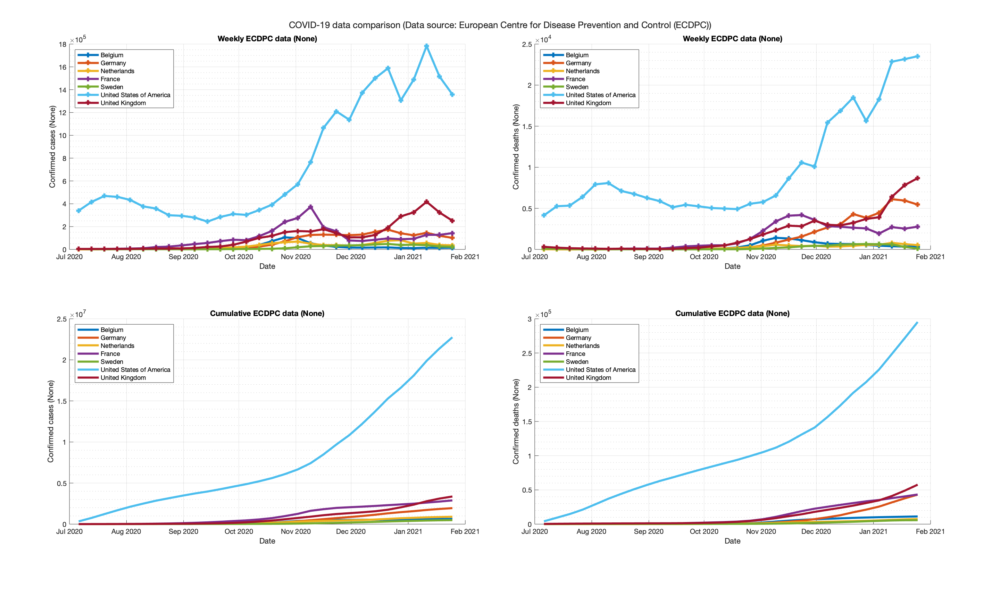

# CoronaPlotter

Simple MATLAB function for plotting the amount of COVID-19 cases and deaths of any country in the world over time.

Every time you run the function, the most recent data from the European Centre for Disease Prevention and Control is downloaded. 
Data source: https://www.ecdc.europa.eu/en/publications-data/download-todays-data-geographic-distribution-covid-19-cases-worldwide

Format of the function: `corona_plot(start_date, end_date, countries, option)`  
`start_date` & `end_date`: Define the time window in which you want to plot data  
`countries`: List of countries (can be one or multiple countries, which gives you the ability to compare data between countries)  
`option`: Absolute data if omitted, data per capita if input is `per capita` (usefull for comparing countries relatively)  

## Examples
#### Per capita
`corona_plot('01-Jul-2020 00:00:00', '30-Jan-2021 00:00:00', ["Belgium", "Germany", "Netherlands", "France", "Sweden", "United_States_of_America", "United_Kingdom"], 'per capita')`

#### Absolute
`corona_plot('01-Jul-2020 00:00:00', '30-Jan-2021 00:00:00', ["Belgium", "Germany", "Netherlands", "France", "Sweden", "United_States_of_America", "United_Kingdom"])`

